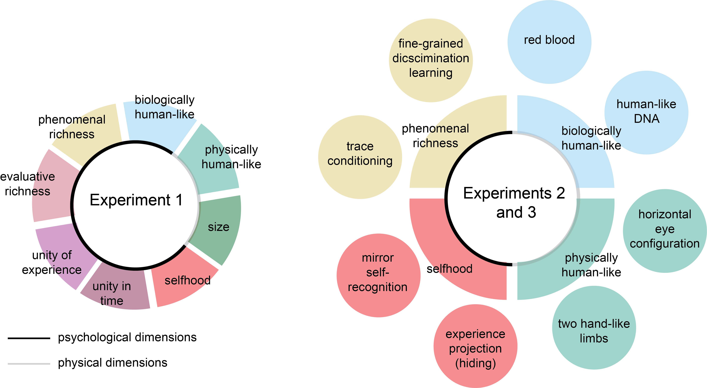

# Dimensions of moral status

Matan Mazor 🔥, Ariana Risoli 🔥, Anna Eberhardt 🔥 & Steve Fleming 🔥

A project looking at mental and physical attributes that contribute to beliefs about consciousness and ascription of moral status to non-human agents.

