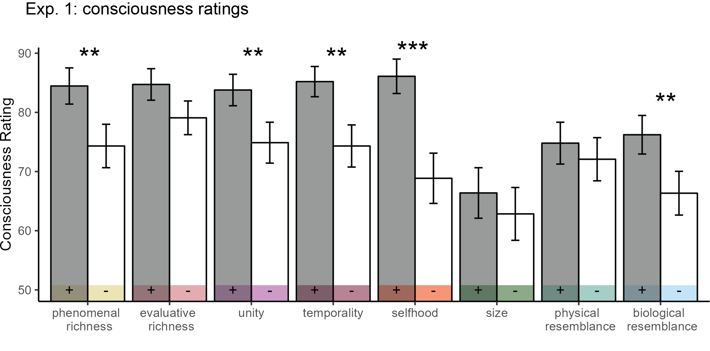
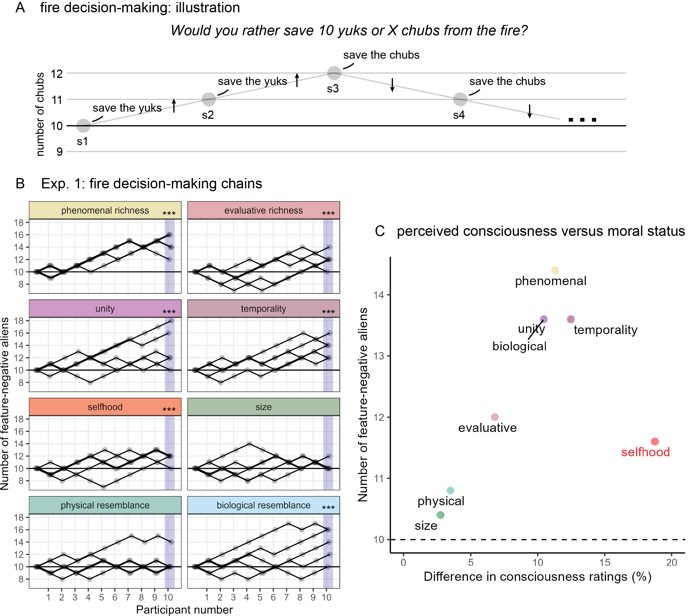
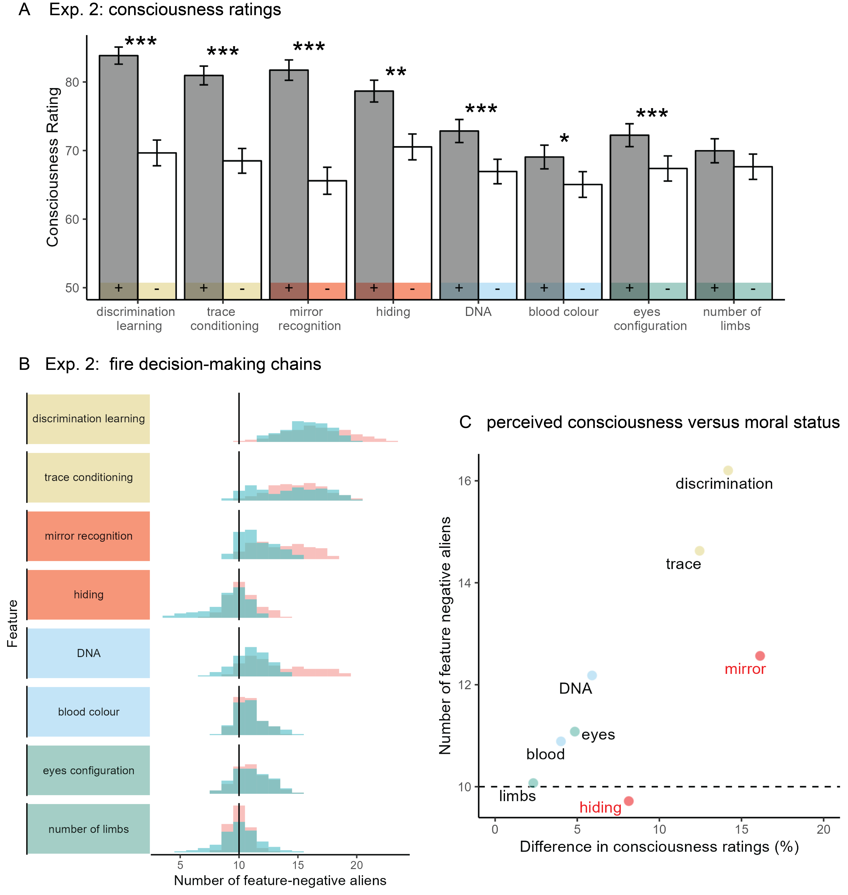
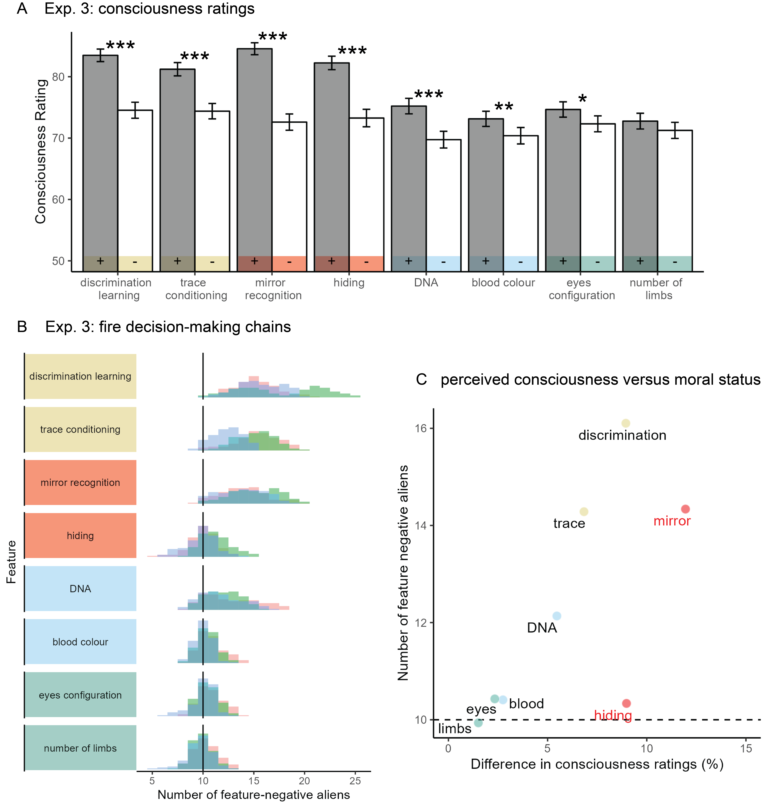
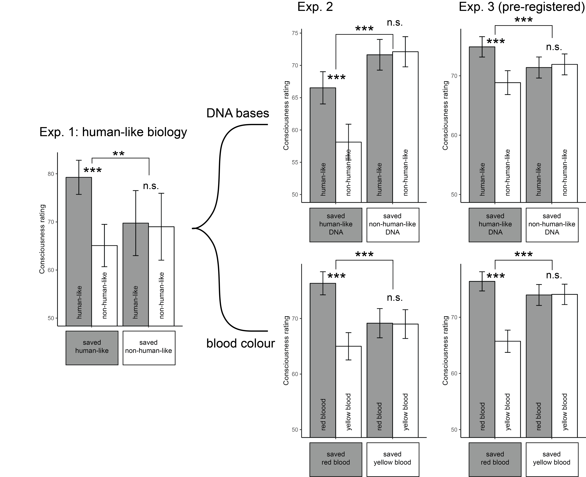

```{r, setup, include = FALSE}
library('groundhog')
groundhog.library(
  c('papaja',
    'tidyverse',
    'ggrepel',
    'LaplacesDemon' # for ESS
    ), "2023-12-01"
)
knitr::opts_chunk$set(fig.pos = "!H", out.extra = "",warning=F,echo=F,message=F,cache=T)

```

# Introduction

An entity has *Moral Status* if and only if "it or its interests morally matter to some degree for the entity’s own sake" [@jaworska2013]. The attribution of moral status to a being affects how their interests are taken into account in everyday decision making. For example, the choice not to eat meat is often motivated by an attribution of non-trivial moral status to farm animals. But how do we decide which entities are worthy of a higher moral status, or, conversely, which can be exploited and harmed without concern for their interests?

Philosophers have long debated which factors should be taken into account when determining the moral status of agents. Utilitarian philosophers Jeremy Bentham [-@bentham1789] and John Stuart Mill [-@mill1861] attached moral status to the capacity to suffer, or to sentience more generally. Contemporary philosophical writings about the origins of moral status debate the extent to which they should be based in private, qualitative experience, or rather in functional or behavioural features which can be observed by others and scientifically quantified [@carruthers2019; @danaher2020; @levy2014; @dawkins2003]. Crucially, regardless of what the normative answer to this question is, in actual moral decision-making we only have access to the behaviour of other agents, and need to infer their internal states from these third-person observations. In other words, regardless of whether moral status *should* be based on behaviour or experience, in practice it *must* be based on behaviour, because we can never directly perceive the subjective experience of others.

In psychology, behavioural observations are commonly used to learn about internal mental processes, which are often assumed to have an experiential nature for the subject. In comparative psychology, clever experimental manipulations allow scientists to deduce latent mental variables from observable behaviour. The mirror mark test is one such manipulation, in which an animal's response to an unfamiliar mark on its own reflection in the mirror is taken as a measure of self-awareness – a mental property that cannot be directly observed [@gallup1970]. Other known examples are the study of caching behaviour as a measure of episodic memory [@clayton1998] and the use of trace-conditioning as a measure of conscious perception [@clark2002]. In all of the above examples, scientists explain an observable behaviour as emerging from an internal mental state.

Here we asked whether non-scientists would also use these and similar behaviours as indicating the presence of private mental states. We then asked whether these inferences about consciousness would bias participants' moral decision making, and whether some dimensions of conscious experience [@birch2020] contribute to moral status more than others.

# Experiment 1

## Methods

In order to isolate the unique effects of single behavioural and physiological features, independent of preconceptions about specific alien species or AI architectures, ndefinedwe followed @piazza2016 and desgcribed imaginary aliens on a distant planet. According to the story, scientists have discovered several alien species on the planet, which all have two eyes and hand-like limbs, and all feed on space berries that grow on the planet. The scientists sorted the alien species into 8 pairs such that within each such pair the two species were identical except for two differences. The experiment then consisted of descriptions of the 8 animal pairs, followed by qu

For each pair, participants were asked to describe in their own words the main difference between the two alien species. This allowed us

eewilks2021]. Lastly, participants were asked to use two sliders to indicate the extent to which they thought each species was conscious.

For the fire dilemma, the number of aliens in the feature-positive group (see below) was always 10. We determined the number of aliens in the feature-negative group based on the moral decisions of previous participants, following a Markov Chain Monte Carlo with People procedure [@sanborn2010]. Specifically, 5 chains of 10 participants completed the experiment. Within each chain, the first participant decided between two groups of 10 aliens for all dimensions. In case the participant decided to save the feature-positive group, the number of feature-negative aliens was increased by 1 for the next participant in the chain. In case they decided to save the feature-negative group, the number of feature-negative aliens was decreased by 1 for the next participants in the chain. The same rule was then followed for all 10 participants in the chain.

Within each pair, the aliens varied along one of the following dimensions of interest: phenomenal richness, evaluative richness, unity, temporality, selfhood, size, physical resemblance to humans in appearance, and biological resemblance to humans (see Fig. \@ref(fig:design), left panel). The first 5 dimensions are based on a taxonomy of animal consciousness, described in @birch2020. The *feature-positive* species had more of the mental capacity of interest, or resembled humans more, compared with the *feature-negative* species. Each dimension was presented as two scientific findings, followed by their interpretation by the scientists, and was accompanied by cartoon figures of the experimental design. The findings and their interpretations were based on real animal studies. Alien species were given one-syllable gibberish names, fully counterbalanced across participants. Below we describe the 8 dimensions and their experimental operationzaliations, based on animal studies. The full descriptions as presented to our subjects are available at [github.com/matanmazor/dimensions_of_moral_status](https://github.com/matanmazor/dimensions_of_moral_status).

1.  *Phenomenal Richness:* Phenomenal richness is roughly defined as the 'level of detail with which [animals] consciously perceive aspects of their environment' [@birch2020]. Phenomenal richness can vary between different sensory modalities, but for our study we focused on phenomenal richness in visual experience. While both alien species could see things and learn simple rules, only the feature-positive aliens could "tell the difference between very similar objects (for example, very similar shades of red)" [*fine-grained discrimination learning,* @pearce2008]. In addition, only feature-positive aliens could learn to associate between a light and a treat even when the treat is given as long as one second after the light (as opposed to only when the treat is given immediately) [*trace-conditioning*, @clark2002].

2.  *Evaluative Richness:* Evaluative richness is to valence what phenomenal richness is to sense data. It is roughly defined as the ability to evaluate small changes in valence and to engage in complex affect-based decision-making [@birch2020]. While both alien species had good and bad moods, liked sweet berries and disliked the cold, only feature-positive aliens had a tendency to look away from angry faces when in a bad mood [*affective bias*, @reimert2017], and tended to sustain uncomfortably cold tempertaures for sweeter berries [*motivational trade-off*, @balasko1998].

3.  *Unity:* Unity is roughly defined as having a "single, unified perspective as opposed to multiple perspectives" [@birch2020]. Only feature-positive aliens could recognize a fruit by touch alone after having seen it, without ever touching it before [*crossmodal integration,* @narins2005]. Also, only feature-positive aliens could generalise a trained association from their trained left eye to the untrained right eye [*interoccular transfer*, @ortega2008].

4.  *Temporality:* Temporality is roughly defined as having an integrated stream of experience, as opposed to "a staccato series of fragmented experiences" [@birch2020]. Temporality can be defined over short and long time scales. Here we focused on future planning over longer time scales (days). We described two future-planning paradigms: only feature-positive aliens chose to keep a tool that would help them to solve a problem at a later time [@kabadayi2017], and preferred to wait for unripe fruit to ripen before eating them [@hillemann2014].

5.  *Selfhood:* Selfhood is "the conscious awareness of oneself as distinct from the world outside" [@birch2020]. While both alien species aliens liked to keep themselves clean, only the feature-positive group would act to remove a fleck of dirt on their forehead if they see it in the mirror [*mirror self-recognition*, @gallup1970]. Also, while both alien species sometimes stole food from their neighbours, only the feature-positive aliens attempted to hide themselves when caught [*experience projection*, @dewaal1986].

6.  *Size:* Feature-positive aliens were described as having average weight and height of 45kg and 120cm, while feature-negative aliens had average weight and height of 1 gram and 1 cm.

7.  *Physical resemblance to humans:* Feature-positive aliens were described as having right and left eyes, and two hand-like limbs. Feature-negative aliens had upper and lower eyes, and 5 hand-like limbs.

8.  *Biological resemblance to humans:* Feature-positive aliens were described as having red blood, and DNA that is composed of the same four bases as human DNA. Feature-negative aliens had yellow blood, and DNA that is composed of entirely different bases.

```{r design, echo=FALSE, fig.cap="Manipulated dimensions. In Exp. 1, we manipulated eight dimensions: five psychological and five physical. In Exp. 2 and 3, we focused on a subset of four dimensions: phenomenal richness in vision, selhood, physical resemblance to humans, and biological resemblance to humans. Each dimension was broken down into two scientific observations."}
knitr::include_graphics("figs/design.png")
```

## Results

```{r load_and_format, echo=FALSE, cache=TRUE, results='hide'}
# source('../analysis/loadAndOrganiseData.R')

exp1_df = read.csv('../experiments/Exp1/data/all_data.csv')
exp2_df = read.csv('../experiments/Exp2/data/all_data.csv')
exp3_df = read.csv('../experiments/Exp3/data/all_data.csv')


```

The research complied with all relevant ethical regulations and was approved by the Research Ethics Committee of University College London (study ID number 1260/003). Participants were recruited via Prolific and gave informed consent prior to their participation. They were selected based on their acceptance rate (\>95%) and for being native English speakers. A total of 50 participants took part in Exp. 1, in 5 chains of 10 participants each. Participants provided meaningful descriptions of the different dimensions. All recorded responses, including verbal descriptions, are openly available on [github.com/matanmazor/dimensions_of_moral_status](https://github.com/matanmazor/dimensions_of_moral_status). This first experiment was not pre-registered.

### Consciousness ratings

```{r consc1_diff, echo=FALSE, cache=TRUE}
exp1.long_df <- exp1_df %>%
  dplyr::select('chain_number',
         'participant_number',
         'subj_id',
         'dimension',
         'mwj',
         'conscPos',
         'conscNeg') %>%
  gather(species, consc, 6:7) %>%
  mutate(species=substr(species,6,9)) %>%
  mutate(species=factor(species, levels=c('Neg','Pos')));

# main difference in consciousness ratings between positive and negative aliens
exp1.main_diff <- exp1.long_df %>% 
  mutate(subj_id=participant_number+chain_number*100) %>%
  group_by(subj_id, dimension) %>%
  summarise(diff=consc[species=='Pos']-consc[species=='Neg']) %>% 
  dplyr::select(subj_id,dimension,diff) %>%
  spread(dimension,diff) %>%
  mutate(global=mean(appearance:unity))


```

Participants rated the consciousness level of the different alien species on a scale of 1 to 100. Overall, consciousness ratings were high, with a distinctive peak at the maximum rating of 100 (mean rating = `r printnum(exp1.long_df$consc%>%mean())`). Feature-positive species were perceived as substantially more conscious than feature-negative species (`r apa_print(exp1.main_diff$global%>%t.test())$full_result`; see Fig. \@ref(fig:consc1)). This difference in consciousness ratings was significant for the dimensions phenomenal richness (`r apa_print(exp1.main_diff$pRichness%>%t.test())$full_result`), unity (`r apa_print(exp1.main_diff$unity%>%t.test())$full_result`), temporality (`r apa_print(exp1.main_diff$time%>%t.test())$full_result`), and selfhood (`r apa_print(exp1.main_diff$self%>%t.test())$full_result`). Interestingly, perceived consciousness was also higher for aliens that are more biologically similar to humans (`r apa_print(exp1.main_diff$biology%>%t.test())$full_result`). These effects survived a Bonferroni correction across the 8 comparisons. The effects for evaluative richness and size on consciousness ratings were significant but did not survive correction for multiple comparisons.

```{r consc1, echo=FALSE, cache=TRUE, fig.cap="Mean consciousness ratings in Exp. 1. The feature-positive and feature-negative aliens are presented in grey and white, respectively. Error bars represent the standard error of the mean. Starts represent statistical significance after a Bonferroni correction for multiple comparisons. p<0.01: &ast;&ast;, p<0.001: &ast;&ast;&ast;"}
exp1.long_df <- exp1_df %>%
  dplyr::select('chain_number',
         'participant_number',
         'subj_id',
         'dimension',
         'mwj',
         'conscPos',
         'conscNeg') %>%
  gather(species, consc, 6:7) %>%
  mutate(species=substr(species,6,9)) %>%
  mutate(species=factor(species, levels=c('Neg','Pos')));

# main difference in consciousness ratings between positive and negative aliens
exp1.main_diff <- exp1.long_df %>% 
  mutate(subj_id=participant_number+chain_number*100) %>%
  group_by(subj_id, dimension) %>%
  summarise(diff=consc[species=='Pos']-consc[species=='Neg']) %>% 
  dplyr::select(subj_id,dimension,diff) %>%
  spread(dimension,diff) %>%
  mutate(global=mean(appearance:unity))



```

### Moral judgments

```{r mwj1, echo=FALSE, cache=TRUE}

exp1.mwj_df <- exp1_df %>%
  dplyr::select('chain_number',
         'participant_number',
         'subj_id',
         'dimension',
         'mwj',
         'numNeg',
         'consc_diff') %>%
  mutate(numNegPost = ifelse(mwj=='pos',
                    numNeg+1,
                    numNeg-1));

# for visualization
exp1.mwj_zeroth_participant <- exp1.mwj_df %>%
  filter(participant_number==10) %>%
  mutate(
    participant_number=0,
    subj_id=0,
    numNeg = 10,
    numNegPost = 10)


exp1.mwj_df <- bind_rows(exp1.mwj_df, exp1.mwj_zeroth_participant);

# average N- at the end of the chain
exp1.end_of_chain <- exp1.mwj_df %>%
  filter(participant_number==10) %>% 
  group_by(dimension) %>%
  summarise(numNegPost=mean(numNegPost)) %>%
  spread(dimension,numNegPost)
```

For each dimension, participants decided whether they would rather save aliens from the feature-negative or the feature-positive species. The number of feature-positive aliens ($N^+$) was always set to 10, and the number of feature-negative aliens ($N^-$) followed a staircase procedure determined by the moral judgments of previous participants -- decreasing after decisions to save the feature-negative aliens, and increasing following decisions to save the feature-positive aliens (see Fig. \@ref(fig:exp1)A). We ran 5 short (10 participant) chains in an attempt to validate our method and establish a directional effect for our dimensions of interest. The chains are unlikely to have converged after 10 participants, so final numbers should not be interpreted as reflecting a true 'conversion rate' between feature-positive and feature-negative aliens.

```{r exp1, echo=FALSE, cache=TRUE, fig.cap="Exp. 1: results. A: the between-subject staircase procedure. Each circle represents one participant. The number of feature-negative aliens increased following decisions to save the feature-positive group, and decreased following decisions to save the feature-negative group. B: the number of feature-negative aliens in the five chains, for each of the eight dimensions. C: mean number of feature-negative aliens at the end of the chain, plotted against the difference in consciousness ratings per individual dimensions. "}



```

```{r mwj_simulation, echo=FALSE, cache=TRUE}

# simulating a null model for hypothesis testing.

# null = c();
# for (simulation in seq(1,100000)) {
#   numNeg_vec = c();
#   for (chain in seq(1,5)) {
#     numNeg=10
#     for (i_s in seq(1,10)) {
#       if (rbinom(1,1,0.8)) {
#         if (numNeg<10) {
#           numNeg=numNeg+1
#         } else if (numNeg>10) {
#           numNeg=numNeg-1
#         } else {
#           numNeg=numNeg+sample(c(-1,1),1);
#         }
#       } else{
#         numNeg=numNeg+sample(c(-1,1),1);
#       }
#     }
#     numNeg_vec = append(numNeg_vec,numNeg);
#   }
#   mean_numNeg = mean(numNeg_vec);
#   null = append(null,mean_numNeg);
# };
# 
# save('null',file='../analysis/exp1_null.RData')
load('../analysis/exp1_null.RData')
two_sided_null = abs(null-10)


```

We focused on the average value of $N^-$ at the end of the chain. This value was equal or higher than 10 for all dimensions (see Fig. \@ref(fig:exp1)B). Specifically, it was `r printnum(exp1.end_of_chain$pRichness)` for phenomenal richness, `r printnum(exp1.end_of_chain$eRichness)` for evaluative richness, `r printnum(exp1.end_of_chain$time)` for temporality and `r printnum(exp1.end_of_chain$time)` for unity. Paralleling the effect of biological resemblance to humans on consciousness, aliens that were biologically similar to humans were also more likely to be saved from the fire ($N^-$=`r printnum(exp1.end_of_chain$biology)`).

If our participants were only considering the number of aliens in each group, without any consistent effect of the manipulated dimensions, we would expect $N^-$ to be exactly 10 by the 10th participant. This was the case in four out of five chains for the appearance and size dimensions. As a more conservative null model, we simulated data from a cohort of participants that choose to save the larger group of aliens on 80% of the trials, and choose randomly on the remaining 20%. The average $N^-$ for the last participant exceeded 11 (or went below 9) only on `r sum(two_sided_null>1)` of 10,000 simulations, and never exceeded 12. Hence, we find strong evidence against this conservative null-effect model for all 5 dimensions of consciousness, as well as for biological resemblance to humans, but not for size and appearance. In the last section of our analysis, we asked whether beliefs about consciousness systematically covary with biases in moral decision making.

### The relation between moral judgments and consciousness ratings

```{r relation1, echo=FALSE, cache=TRUE}
exp1.relation_df <- exp1.mwj_df %>% 
  group_by(dimension) %>%
  summarise(consc_diff=mean(consc_diff), 
            numNeg=mean(numNegPost[participant_number==10]))
```

So far we have shown that in our data, the perceived consciousness of imaginary aliens was informed by descriptions of behaviours which are interpreted in the scientific literature on animal consciousness as signs of phenomenal richness, evaluative richness, unity, temporality, and selfhood [@birch2020], as well as by beliefs about their biological resemblance to humans. We also showed that the same factors contributed to moral judgments about these imaginary aliens. Our experimental design was not optimized to test for a causal link between these two findings, but it did allow us to quantify the extent to which variability in beliefs about consciousness explains variability in judgments of moral status.

Across dimensions, high values of $N^-$ were associated with a more pronounced difference between consciousness ratings for the feature-positive and feature-negative alien species (see Fig. \@ref(fig:exp1)C). One exception was selfhood, scoring highest in consciousness ratings (with a mean difference of `r printnum(exp1.relation_df[exp1.relation_df$dimension=='self','consc_diff'])` between feature-positive and feature-negative aliens), but having only moderate effects on moral status judgments ($N^-$=`r exp1.relation_df[exp1.relation_df$dimension=='self','numNeg']`). Indeed, the effect on perceived consciousness correlated with $N^-$ only when excluding the selfhood dimension (`r apa_print(cor.test(exp1.relation_df%>%filter(dimension!='self')%>%pull(consc_diff),exp1.relation_df%>%filter(dimension!='self')%>%pull(numNeg)))$full_result`), but not when including it (`r apa_print(cor.test(exp1.relation_df%>%pull(consc_diff),exp1.relation_df%>%pull(numNeg)))$full_result`). In Experiment 2 and 3 we look closer at the two operationalizations of selfhood in our study, mirror self recognition and a tedency to hide after a shameful act, and ask whether this mismatch between consciousness ratings and moral worth judgments is common to both.

# Experiment 2

In Experiment 1, we found that short descriptions of scientific findings affected participants' attribution of consciousness to imaginary aliens as well as the value they attached to their lives. We also found evidence for a relationship between these two effects, reflected in the alignment of consciousness ratings and moral status judgments across subjects and dimensions. One exception to this alignment was the selfhood dimension, where a strong effect on the attribution of consciousness did not translate to a strong effect on moral status judgments. Finally, while size and physical appearance had no effect on the attribution of consciousness and moral status judgments, biological resemblance to humans had strong effects on both. In Experiment 2, we zero in on these effects and focus on the dimensions of selfhood, biological resemblance to humans, phenomenal richness, and physical resemblance to humans in appearance (see Fig. \@ref(fig:design), right panel).

## Methods

Experiment 2 followed a similar procedure to Experiment 1, with the following changes. First, each alien pair corresponded to a single scientific observation: mirror self-recognition [@gallup1970], experience projection (hiding) [@dewaal1986], blood color, DNA building blocks, discrimination learning [@pearce2008], trace conditioning [@clark2002], eye position (vertical or horizontal configuration) and number of limbs (2 or 5). Second, participants were not given information about the way scientists interpreted the findings. Third, to simplify and shorten the experiment, we simplified some of the descriptions, and omitted all figures. Finally, in order to allow the MCMC chains to converge, we ran two longer chains of around 100 participants each. Experiment 2 was not pre-registered.

## Results

A total of 212 English-speaking adults took part in the experiment, in 2 chains of 105 and 107 participants. Participants provided meaningful descriptions of the different dimensions. All recorded responses, including verbal descriptions, are openly available on [github.com/matanmazor/dimensions_of_moral_status](https://github.com/matanmazor/dimensions_of_moral_status).

### Consciousness ratings

```{r consciousness_ratings2, echo=FALSE, cache=TRUE}
exp2.long_df <- exp2_df %>%
  dplyr::select('chain_number',
         'participant_number',
         'subj_id',
         'dimension',
         'mwj',
         'conscPos',
         'conscNeg') %>%
  gather(species, consc, 6:7) %>%
  mutate(species=substr(species,6,9)) %>%
  mutate(species=factor(species, levels=c('Neg','Pos')),
         dimension=factor(dimension, levels=c(
        'eyes',
        'limbs',
        'DNA',
        'blood',
        'discrimination',
        'trace',
        'mirror',
        'deception')));

exp2.main_diff <- exp2.long_df %>% 
  distinct(subj_id, dimension, species, .keep_all = TRUE) %>%
  group_by(subj_id, dimension) %>%
  summarise(diff=consc[species=='Pos']-consc[species=='Neg']) %>% 
  dplyr::select(subj_id,dimension,diff) %>%
  pivot_wider(names_from=dimension,values_from=diff) %>%
  mutate(global=mean(eyes:deception))

```

Participants reported the degree to which they believed the different alien species were conscious, on a scale of 1 to 100. Similar to Exp. 1, consciousness ratings were high, with a distinctive peak at the maximum rating of 100 (mean rating = `r printnum(exp2.long_df$consc%>%mean())`; see Fig. \@ref(fig:exp2)A). Feature-positive species were perceived as substantially more conscious than feature-negative species (`r apa_print(t.test(exp2.main_diff$global))$full_result`). This difference in consciousness ratings was significant for all features (corrected for multiple comparisons) except for the number of limbs. Notably, eye configuration, blood colour, and the composition of DNA molecules, all affected the perceived consciousness of aliens.

```{r exp2, echo=FALSE, cache=TRUE, fig.cap="Exp. 2: results. A: mean consciousness rating per alien species. B: histograms of N- values across the two chains, excluding the first 10 steps. C: mean number of feature-negative aliens at the end of the chain, plotted against the difference in consciousness ratings per individual dimensions. Self-awareness items are marked in red."}



```

### Moral judgments

```{r mwj2, echo=FALSE, cache=TRUE}
exp2.mwj_df <- exp2_df %>%
  dplyr::select('chain_number',
         'participant_number',
         'subj_id',
         'dimension',
         'mwj',
         'numNeg',
         'consc_diff') %>%
  mutate(numNegPost = ifelse(mwj=='pos',
                    numNeg+1,
                    numNeg-1));

# average N- at the end of the chain
exp2.end_of_chain_by_chain <- exp2.mwj_df %>%
  filter(participant_number>10) %>% 
  dplyr::group_by(dimension, chain_number) %>%
  dplyr::summarise(numNeg=mean(numNegPost))%>%
  spread(dimension,numNeg)

# average N- at the end of the chain
exp2.end_of_chain <- exp2.mwj_df %>%
  filter(participant_number>10) %>% 
  dplyr::group_by(dimension) %>%
  dplyr::summarise(numNeg=mean(numNegPost))%>%
  spread(dimension,numNeg)
```

Similar to experiment 1, participants decided whether they would rather save aliens from the feature-negative or the feature-positive species. Here also, the number of feature-positive aliens ($N^+$) was always set to 10, and the number of feature-negative aliens ($N^-$) followed the moral judgments of previous participants. Longer chains allowed us to estimate the conversion rate between feature-positive and feature-negative aliens for each of our eight features. We discarded the first 10 $N^-$ values as a burn-in period, and took the mean of the remaining values as our estimate for $N^-$. Generally, we observed high levels of agreement between the two chains (see Fig. \@ref(fig:exp2)B). One exception was mirror recognition, with mean $N^-$ of `r printnum(exp2.end_of_chain_by_chain$mirror[1])` and `r printnum(exp2.end_of_chain_by_chain$mirror[2])` for chains number 1 and 2.

In line with the results from Experiment 1, $N^-$ was highest for discrimination learning (`r printnum(exp2.end_of_chain$discrimination)`) and trace conditioning (`r printnum(exp2.end_of_chain$trace)`), both operationalisations of the phenomenal richness dimension from Exp. 1. In other words, participants valued the lives of aliens who showed signs of visual phenomenal richness about 1.5 more than the lives of aliens who did not show these signs. This is particularly striking for discrimination learning, where this difference in moral status was driven by the subtle fact that feature-positive, but not feature-negative aliens could "tell the difference between very similar objects (for example, very similar shades of red)".

Next, mirror self-recognition had moral value ($N^-=$ `r printnum(exp2.end_of_chain$mirror)`, but see above comment about convergence), whereas the tendency to hide after a shameful act (stealing from others), also typically taken as a sign of self-awareness, had a neutral moral value ($N^-=$ `r printnum(exp2.end_of_chain$deception)`). This was the case even though participants saw it as a reliable sign of consciousness (mean difference in consciousness ratings for hiders and non-hiders: `r apa_print(t.test(exp2.main_diff$deception))$estimate`). Participants also attributed greater value to the lives of aliens whose DNA was composed of the same DNA bases as human DNA ($N^-=$ `r printnum(exp2.end_of_chain$DNA)`). Finally, eye configuration ($N^-=$ `r printnum(exp2.end_of_chain$eyes)`), the colour of the blood ($N^-=$ `r printnum(exp2.end_of_chain$blood)`), and the number of limbs ($N^-=$ `r printnum(exp2.end_of_chain$limbs)`), all had only small to negligible effects on moral judgments.

```{r relation2, echo=FALSE, cache=TRUE}
exp2.relation_df <- exp2.mwj_df %>% 
  group_by(dimension) %>%
  summarise(consc_diff=mean(consc_diff), 
            numNeg=mean(numNegPost[participant_number>10]))
```

## The relation between moral judgments and consciousness ratings

Consciousness ratings were strongly aligned with $N^-$ across features (see Fig. \@ref(fig:exp3)C). Similar to Experiment 1, this linear alignment was stronger when excluding the self-related mirror self-recognition and hiding after a shameful act (correlation without selfhood-related items: `r apa_print(cor.test(exp2.relation_df%>%filter(!dimension %in% c('mirror','deception'))%>%pull(consc_diff),exp2.relation_df%>%filter(!dimension %in% c('mirror','deception'))%>%pull(numNeg)))$full_result`; correlation with selfhood-related items: `r apa_print(cor.test(exp2.relation_df%>%pull(consc_diff),exp2.relation_df%>%pull(numNeg)))$full_result`).

# Experiment 3

Experiment 3 was designed to replicate Exp. 2 in a pre-registered sample.

## Methods

A total of 390 participants took part in Exp. 3, in three chains of 130 participants. Apart from the number of participants, it was identical to Exp. 2. A pre-registration document is available at <https://doi.org/10.17605/OSF.IO/DYSQZ>.

## Results

### Consciousness ratings

```{r consciousness_ratings3, echo=FALSE, cache=TRUE}
exp3.long_df <- exp3_df %>%
  dplyr::select('chain_number',
         'participant_number',
         'subj_id',
         'dimension',
         'mwj',
         'conscPos',
         'conscNeg') %>%
  gather(species, consc, 6:7) %>%
  mutate(species=substr(species,6,9)) %>%
  mutate(species=factor(species, levels=c('Neg','Pos'))) %>%
  mutate(class=ifelse(dimension=='discrimination' | 
                        dimension=='trace' | 
                        dimension=='mirror' |
                        dimension=='deception',
                      'psych',
                      'phys'));

exp3.main_diff <- exp3.long_df %>% 
  distinct(subj_id, dimension, species, .keep_all = TRUE) %>%
  group_by(subj_id, dimension) %>%
  summarise(diff=consc[species=='Pos']-consc[species=='Neg']) %>% 
  dplyr::select(subj_id,dimension,diff) %>%
  pivot_wider(names_from=dimension,values_from=diff) %>%
  mutate(global=mean(eyes:deception),
         psych=mean(c(deception,discrimination,mirror,trace)),
         phys=mean(c(DNA,blood,eyes,limbs)))

```

A significant difference in consciousness ratings between feature positive and feature negative aliens was observed for all alien pairs. All effects apart from the number of limbs survived a Bonferroni correction for multiple comparisons. Furthermore, an analysis of variance revealed that a difference in consciousness ratings between feature-positive and feature-negative aliens was significantly different for the 8 features of interest (`r apa_print(aov(consc~species*dimension,data=exp3.long_df)%>%summary())$statistic$species_dimension`). A post-hoc t-test confirmed that the difference in consciousness ratings was significantly higher in the four psychological items than in the physical ones (`r apa_print(t.test(exp3.main_diff$psych-exp3.main_diff$phys))$full_result`).

```{r exp3, echo=FALSE, cache=TRUE, fig.cap="Exp. 3: results. A: mean consciousness rating per alien species. B: histograms of N- values across the two chains, excluding the first 30 steps. C: mean number of feature-negative aliens at the end of the chain, plotted against the difference in consciousness ratings per individual dimensions. Self-awareness items are marked in red."}



```

```{r mwj3, echo=FALSE, cache=TRUE}

exp3.mwj_df <- exp3_df %>%
  dplyr::select('chain_number',
         'participant_number',
         'subj_id', 
         'dimension',
         'mwj',
         'numNeg',
         'consc_diff') %>%
  mutate(numNegPost = ifelse(mwj=='pos',
                    numNeg+1,
                    numNeg-1));

# average N- at the end of the chain
exp3.end_of_chain <- exp3.mwj_df %>%
  filter(participant_number>30) %>% 
  dplyr::group_by(dimension, chain_number) %>%
  dplyr::summarise(numNeg=mean(numNegPost))%>%
  spread(dimension,numNeg)
  
  # nonparametric test to account for autocorrelation
  
  proportion_higher_than_10 <- exp3.mwj_df %>%
  filter(participant_number>30) %>%
  mutate(higher_than_ten=ifelse(numNegPost>10,1,0)) %>%
  group_by(dimension) %>%
  summarise(p_value=1-mean(higher_than_ten)) %>%
  spread(dimension,p_value)

```

### Moral judgments

To test for the effect of alien descriptions on moral status, we examined the distribution of $N^-$ values for each alien pair. In order not to inflate our false-positive rate due to the temporally autocorrelated structure of single chains, we revised our pre-registered plan and extracted the effective sample size using Neal's approximation [@kass1998] before running a t-test against 10. Even using this conservative method, $N^-$ values were significantly higher than 10 in all items apart from the number of limbs and experience projection (hiding).

```{r relation3, echo=FALSE, cache=TRUE}
exp3.relation_df <- exp3.mwj_df %>% 
  group_by(dimension) %>%
  summarise(consc_diff=mean(consc_diff), 
            numNeg=mean(numNegPost[participant_number>30]))
```

```{r}
full_r_squared = summary(lm(consc_diff~numNeg,data=exp3.relation_df))$r.squared;
no_self_r_squared = summary(lm(consc_diff~numNeg,data=exp3.relation_df %>%
                                 filter(dimension != 'mirror' & dimension != 'deception')))$r.squared;

delta= no_self_r_squared-full_r_squared;

null_dist = c();

features = exp3.relation_df$dimension%>%as.character()%>%unique();
 
for (i in 1:7){
  for (j in i:8) {
    random_drop_r_squared = summary(lm(consc_diff~numNeg,data=exp3.relation_df %>%
                                 filter(dimension != features[i] & dimension != features[j])))$r.squared;
    random_delta=random_drop_r_squared-full_r_squared;
    null_dist=append(null_dist, random_delta);
  }
}

p_value = sum(delta<=null_dist)/length(null_dist)
```

### The relation between moral judgments and consciousness ratings

Consciousness ratings were strongly aligned with $N^-$ across features (see Fig. 4). Similar to Experiment 1 and 2, this linear alignment held weaker for selfhood-related features: mirror self-recognition and hiding (correlation without selfhood-related items: `r apa_print(cor.test(exp3.relation_df%>%filter(!dimension %in% c('mirror','deception'))%>%pull(consc_diff),exp3.relation_df%>%filter(!dimension %in% c('mirror','deception'))%>%pull(numNeg)))$full_result`; correlation with selfhood-related items: `r apa_print(cor.test(exp3.relation_df%>%pull(consc_diff),exp3.relation_df%>%pull(numNeg)))$full_result`). In a pre-registered test, we extracted the proportion of explained variance for the linear alignment between consciousness ratings and $N^-$ values for all possible subsets of 6 items. The removal of the two self-related items, hiding and mirror self-recognition, produced the best model fit ($p$ `r print_p(p_value, add_equals=TRUE)`), confirming that these two items deviated most from the linear relationship.

# The value of human-like biology

Across the three experiments, we found that biological resemblance to humans had an effect on the perceived consciousness of aliens, as well as on the moral status that participants attached to them. One possibility is that these two effects have unique causes: we attach moral significance to human-like biology independent of the effects that this has on consciousness ascriptions. But an alternative is that the two effects are causally related. For example, we may attach moral significance to human-like biology because learning that someone is biologically similar to us increases the probability that they are conscious.

In order to test if the two effects were related, we contrasted the difference in consciousness ratings between human-like and non-human-like aliens as a function of participants' decision in the fire dilemma. In all three experiments, we find that those participants who saved the biologically human-like group also thought they tended to be more conscious. (see Fig. \@ref(fig:biology)). In Exp. 1, participants who chose to save aliens that resembled humans in their biological makeup also saw these aliens as more conscious (`r apa_print(exp1.mwj_df %>% filter(dimension=='biology' & mwj=='pos')%>%pull(consc_diff)%>%t.test())$statistic`), but this was not true for participants who chose to save the feature-negative group (`r apa_print(exp1.mwj_df %>% filter(dimension=='biology' & mwj=='neg')%>%pull(consc_diff)%>%t.test())$statistic`). The difference between the two groups was in itself significant (`r apa_print(t.test(-consc_diff~mwj, exp1.mwj_df%>%filter(dimension=='biology')))$full_result`).

```{r biology, echo=FALSE, cache=TRUE, fig.cap="The value of human-like biology. Plotting consciousness ratings for the feature-positive (grey) and feature-negative (white) groups as a function of participants' decisions in the fire dilemma. A difference in consciousness ratings between human-like and non-human-like aliens appears only in the group of participants who saved the human-like aliens. Error bars represent the standard error of the mean. ."}



```

The same pattern was observed when focusing on individual markers of human-like biology. Participants who chose to save aliens whose DNA bases were chemically similar to those of humans perceived them as more conscious (Exp. 2: `r apa_print(exp2.mwj_df %>% filter(dimension=='DNA' & mwj=='pos')%>%pull(consc_diff)%>%t.test())$statistic`; Exp. 3: `r apa_print(exp3.mwj_df %>% filter(dimension=='DNA' & mwj=='pos')%>%pull(consc_diff)%>%t.test())$statistic`), whereas participants who chose to save the other group showed no difference (Exp. 2: `r apa_print(exp2.mwj_df %>% filter(dimension=='DNA' & mwj=='neg')%>%pull(consc_diff)%>%t.test())$statistic`; Exp. 3: `r apa_print(exp3.mwj_df %>% filter(dimension=='DNA' & mwj=='neg')%>%pull(consc_diff)%>%t.test())$statistic`), with a significant interaction pattern (Exp. 2: `r apa_print(t.test(consc_diff~mwj, exp2.mwj_df%>%filter(dimension=='DNA')))$statistic`; Exp. 3: `r apa_print(t.test(consc_diff~mwj, exp3.mwj_df%>%filter(dimension=='DNA')))$statistic`). Similarly, participants who chose to save red-blooded aliens thought they were more likely to be conscious than yellow-blooded aliens (Exp. 2: `r apa_print(exp2.mwj_df %>% filter(dimension=='blood' & mwj=='pos')%>%pull(consc_diff)%>%t.test())$statistic`; Exp. 3: `r apa_print(exp3.mwj_df %>% filter(dimension=='blood' & mwj=='pos')%>%pull(consc_diff)%>%t.test())$statistic`), this was not the case for participants who saved the yellow-blooded aliens (Exp. 2: `r apa_print(exp2.mwj_df %>% filter(dimension=='blood' & mwj=='neg')%>%pull(consc_diff)%>%t.test())$statistic`; Exp. 3: `r apa_print(exp3.mwj_df %>% filter(dimension=='blood' & mwj=='neg')%>%pull(consc_diff)%>%t.test())$statistic`), and the interaction was again significant (Exp. 2: `r apa_print(t.test(consc_diff~mwj, exp2.mwj_df%>%filter(dimension=='blood')))$statistic`; Exp. 3: `r apa_print(t.test(consc_diff~mwj, exp3.mwj_df%>%filter(dimension=='blood')))$statistic`). Together, we find a strong coupling between the effects of human-like biology on consciousness ratings and on moral decision-making.

# Discussion

In three experiments, participants made moral judgments about the life and death of imaginary aliens. Using imaginary aliens allowed us to experimentally manipulate beliefs about abstract dimensions (Experiment 1) or specific features (Experiments 2 and 3), and measure their causal effect on moral decision making and beliefs about conscious experience. Both consciousness ratings and moral decisions were sensitive to our manipulation. Specifically, consciousness ratings were affected more by our five dimensions of consciousness [phenomenal and evaluative richness, unity, temporality, and selfhood, based on a taxonomy by @birch2020] than by physical attributes such as biological or physical similarity to humans. Furthermore, we found that dimensions of conscious experience had a substantial effect on participants' moral decisions. Interestingly, in all three experiments markers of low-level visual consciousness had stronger effects on moral decision-making than markers of self-awareness, despite similar effects on consciousness ratings.

Previous work has established a strong relation between moral decision making and the ascription of mental attributes such as intelligence, experience, or agency. For example, beliefs about the capacity for subjective experience were associated with a desire to avoid harm [@gray2007]. Similarly, being told that an animal or an alien was more intelligent made participants more likely to report that it was not OK to eat them [@piazza2016], and this association between perceived intelligence and moral worth was apparent already in young children [@wilks2021]. We build and expand on these findings in two ways. First, adopting a fine-grained taxonomy of dimensions of conscious experience [@birch2020] revealed different effects for different dimensions on moral status, with a surprisingly strong effect for low-level visual capacities. Second, Experiments 2 and 3 provided evidence that people extract information about conscious experience from behavioural observations, similar to the interpretation of behavioural findings by comparative psychologists, and that they use this information to guide their moral decision making. This second finding is especially important in light of the debates over the moral significance of functional versus phenomenal aspects of consciousness [@carruthers2019; @levy2014; @danaher2020], also in the context of ongoing discussions about the possibility of AI consciousness [@danaher2020; @birch2024; ].

In both experiments we found a strong alignment between consciousness ratings and moral status, with the single exception of selfhood and its constituent operationalizations, which contributed to consciousness ratings much more than to moral status. Specifically, mirror recognition had the strongest effect on perceived consciousness of all items in Experiments 2 and 3, but its effect on moral decision-making was consistently lower than that of visual discrimination learning, that is, the capacity to tell between very similar objects. While we are not aware of any study that directly examined the effects of perceived self awareness on moral status, the idea that moral worth is based on self-awareness dates back at least to Emmanuel @kant1785. In a striking contrast with this notion, here we find that beliefs about lower-level aspects of consciousness such as visual awareness and working memory are much more influential for moral decision-making than beliefs about selfhood, more in line with the utilitarian views of @mill1861 and @bentham1789, and more recently with the view of @shepherd2018.

Finally, our findings speak to the ethical significance of consciousness science findings [@mazor2023]. Even seemingly neutral findings such as the capacity to learn associations between events separated in time, or the ability to tell apart similar stimuli, had strong effects on people's decisions in hypothetical questions of life and death. As scientists continue to unravel the mysteries of minds, brains and machines, they inevitably inform and change whose interests we value as a society.
